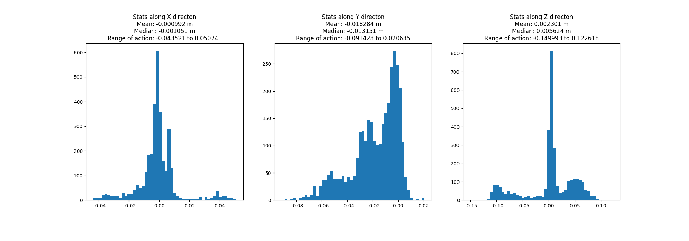

<h1 align="center">
  ToolFlowNet: Robotic Manipulation with Tools via Predicting Tool Flow from Point Clouds</h1>

<div align="center">
  <a href="http://www.cs.cmu.edu/~dseita/">Daniel Seita</a> &nbsp;•&nbsp;
  <a href="https://yufeiwang63.github.io/">Yufei Wang<sup>†</sup></a> &nbsp;•&nbsp;
  <a href="https://sarthakjshetty.github.io/">Sarthak J. Shetty<sup>†</sup></a> &nbsp;•&nbsp;
  Edward Y. Li<sup>†</sup> &nbsp;•&nbsp;
  <a href="https://zackory.com/">Zackory Erickson</a> &nbsp;•&nbsp;
  <a href="https://davheld.github.io/">David Held</a>
</div>

<h4 align="center">
  <a href="https://sites.google.com/view/point-cloud-policy/home"><b>Website</b></a> &nbsp;•&nbsp;
  <a href="https://arxiv.org/abs/2211.09006"><b>Paper</b></a> 
</h4>


This is a `catkin` package that is used to collect human demonstration data in the format that ToolFlowNet expects. We use the generated `pkl` files at the end of the process to train ToolFlowNet on the real-world human demonstration data.

To use this package, first place this folder/repository inside the `src` folder of your `catkin` workspace.

Once you compile and build your `catkin` workspace, you should launch the necessary ROS nodes using:

```
    roslaunch mixed_media mixed_media.launch
```

This command runs the point cloud processing node, that uses depth and RGB images from a Microsoft Kinect v2.

If there are no errors, you should be all set to collect demonstrations or run inference on a trained model.

**Note:** [Here are additional notes] on our specific setup, which involves the [**ReThink Sawyer Arm**](https://www.rethinkrobotics.com/sawyer) and the [**Microsoft Azure Kinect**](https://azure.microsoft.com/en-us/products/kinect-dk/) that we used for the experiments reported in our [**CoRL '22 paper**](https://tinyurl.com/toolflownet).

## Collecting demonstrations:

To collect demonstrations, run `robot.py` with the following flags:

```
python robot.py --policy hum_t_demo --n_targ 1 --num_demos 1
```

**Flags:**

- ``--policy``: Indicates if we're collecting human  (`hum_t_demo`) or algorithimic (`alg_t_demo`) demonstrations or running inference (`run_inference`) with a trained model.
- `--n_targ`: Specifies the number of targets that we're trying to scoop out of the water.
- `--n_demos`: Specifies the number of demos that can be collected at a time. If you're constrained on memory set this to `1`.

### Human Demonstrator:

For the human demonstrator setting, once the robot resets to the starting position, the joint impedance reduces significantly and the arm is compliant enough for a human operator to maneuver and scoop out the ball from the bin.

### Algorithmic Demonstrator:

For the algorithmic demonstrator setting, make sure the environment bounds are correctly stored in `robot.py`.

At the end of each episode, the time-stamped data from the episode will be stored in appropriate folders under the `data/` directory.

## Processing demonstration data:

Here are the instructions for generating observation action pairs from the physical robot experiments.

1. Once the demonstrations have been collected from the ```robot.py``` code, they are saved in the ```data/``` folder.

2. To generate the observation, action pairs use the `visualization.py` code as follows:

    ```
    python visualization.py --folder_name data/policy_scripted_rotation_ntarg_01_ndist_00_maxT_10/data/ --encoding targ
    ```

3. When `visualization.py` runs, we get `pkl`s for each of the demonstrations. This is stored in the respective demonstration session's `pkl_dir_name_save` folder. To collect all the `pkl`s across the entire session, we use `pkl_check.py`. This script moves all the `pkl`s to a single folder and `tar`s them up as well into a `dataset_archive.tar` file.  This is so that we can move the data to a heavier machine for training. Here's the command for `pkl_check.py`:

    ```
    python pkl_check.py --src /data/sarthak/data_demo/data/policy_scripted_rotation_ntarg_01_ndist_00_maxT_10/data/ --dst /data/sarthak/v07_rotation_translation_variably_composed/ --k_steps 1 
    ```

`pkl_check.py` takes 3 arguments, 1. `src` which is the location of the `policy_data` folder. `pkl_check` recursively looks into these folders and finds the `pkl`s. 2. `dst` which is the location where you want to move all these `pkl`s to. 3. `k_steps` since a given `src` might contain `pkl`s from different `k_steps` as well.

4. If you want to analyze some basic stats of the `pkl`s that you're about to train on, you can run `dataset_stats.py` which is available on `toolflownet-physical`. `dataset_stats.py` takes just one argument, `--dataset_loc` which should be the same as `dst` from the previous step. 

    ```
    python dataset_stats.py --dataset_loc /data/sarthak/v07_rotation_translation_variably_composed/
    ```

Once `dataset_stats.py` runs, it generates a simple plot called `dataset_stats.png` and stores in `dataset_loc`. You can visualize histograms of the `act_raw` component across all the `pkl`s in `dataset_loc`. Here is an example:


4. Here, we provide links to the demonstrator data (approximately 25GB) that we used to train the final variant of our model. You can download it using:

    ```
    gdown 1R1ZcdEA3WHr_V0fwOhJiRihiM4pPqhiE
    ```

Untar this zip file using:

```
tar -xvf corl_2022_human_demonstrator_data.tar.gz
```

This should result in a folder called `v06_human_demonstrator_variable_composing_only_PKLs` which should contain the `pkl`s for 125 human demonstrations, necessary to train ToolFlowNet for the physical experiments.

5. To train on this demonstrator, first make sure you're pointing to the right data directories in `launch_bc_mm.py`, including `DATA_HEAD_1` and the `suffix` variable in the main function in the same file. After checking the file variables are pointing to the right location, run:

    ```
    python experiments/bc/launch_bc_mm.py
    ```


## Running inference:

1. To run inference, run `robot.py` with the `run_inference` argument for the `policy` flag:

    ```
    python robot.py --policy run_inference --n_targ=1
    ```

2. On the GPU machine, which contains the trained model, run `inference.py`, available on [`softagent_tfn`](https://github.com/DanielTakeshi/softagent_tfn/tree/physical):

    ```
    python -m bc.inference --exp_config SVD_POINTWISE_3D_FLOW --model_path data/local/BCphy_v06_human_fast_zero_lag_variable_composing_ntrain_0100_PCL_PNet2_svd_pointwise_acttype_flow_rawPCL_scaleTarg/BCphy_v06_human_fast_zero_lag_variable_composing_ntrain_0100_PCL_PNet2_svd_pointwise_acttype_flow_rawPCL_scaleTarg_2022_09_18_21_51_08_0001/model/ckpt_0340.tar --obs_dim 5 --max_n_points 1400 --scale_factor 100.0
    ```

3. The control PC running `robot.py` will now send point cloud observations to the GPU machine, which in-turn will run inference with the trained model and send back end-effector actions to the control PC.

4. You can download the final variant of the model that we used to generate results for our CoRL '22 paper here, using:
    ```
    gdown --folder 163NsJJDxAuSpL6RSsVAEWnT0rbAyPMub
    ```

The inference code uses the checkpoint directly in the ```tar``` format, and therefore you do not need to `untar` it. 

**Note:** This checkpoint is to be used after the `--model` flag in the `bc.inference` command above.

## Contact:
If you run into any issues with the workdlow, please contact the authors to correct/update this ```README```.